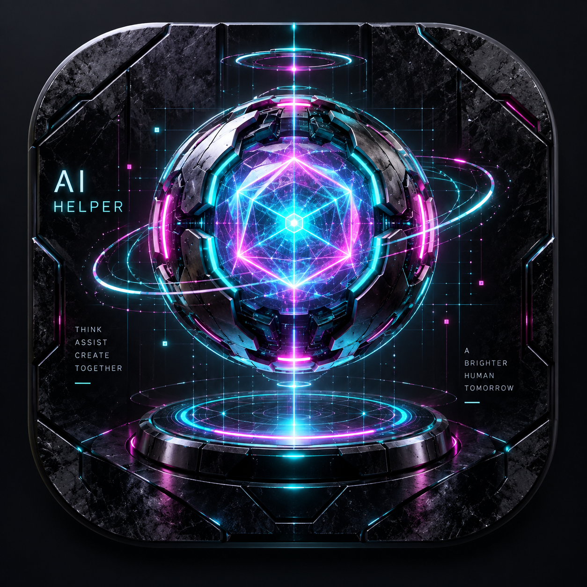

# AI Helper // Cyber Matrix (赛博朋克 AI 辅助集成工具)

<p align="center">
  
</p>

<p align="center">
  <a href="https://github.com/DING-HAO-RAN/ai-helper/releases/latest"></a>
  <a href="https://github.com/DING-HAO-RAN/ai-helper/releases/download/v1.0.0/AI-Helper.exe"></a>
  
  
  
  
  
  
</p>

一款极度轻量、超低资源消耗（内存约 30~50MB）、现代赛博朋克暗黑科技风格的 AI 辅助桌面工具与 AI 命令行接口集成工具。

---

## ✨ 核心特性

### 1. ⚡ 双模合一架构（GUI 桌面应用 + CLI 终端极速调用）
- **CLI 命令行极速响应**：专为各类终端脚本与外部 AI Agent 工具（如 Claude Code、Windsurf、Cursor、Cline 等）量身打造。支持 `ai-helper token get`，不拉起 GUI 窗口，毫秒级直接输出解密后的 GitHub 令牌明文，便于管道读取与环境注入。
- **赛博朋克控制台**：深渊黑底色搭配霓虹青蓝（`#00f0ff`）、电光粉紫（`#ff0055`）与数码绿发光质感；自定义无边框自绘标题栏，左侧功能导航与系统设置分栏，极具科幻未来感。

### 2. 📝 提示词整理宝库 (Prompt Vault)
- **大编辑区**：界面最上方为多行大文本框，支持一键清空、剪贴板快速粘贴、回填修改与存入宝库。
- **长条卡片列表**：界面中下方为垂直平滑滚动卡片，展示提示词名称、最后修改时间及内容摘要，配备【复制】（粒子发光反馈）、【修改】（内容回填至顶部大文本框）、【删除】三联按钮。

### 3. 🔑 GitHub 令牌本地加密保险库 (Token Vault)
- **硬件与系统级安全加密**：采用 Windows 原生 DPAPI（`CryptProtectData` / `CryptUnprotectData`）与 Base64 密文存储，与当前 Windows 用户凭据绑定，即使本地文件被复制到其他设备也无法解密。
- **UI 交互**：支持别名管理、密钥掩码显示、一键显隐切换、明文复制、在线连通性测试（请求 GitHub API 验证并显示用户名与仓库数）、一键设为默认。
- **命令行 (CLI) 快速集成**：
  ```powershell
  # 1. 直接获取默认令牌
  ai-helper token get

  # 2. 获取指定别名令牌
  ai-helper token get work

  # 3. 列出所有本地凭据摘要
  ai-helper token list

  # 4. 终端/AI 自动注入环境变量
  $env:GITHUB_TOKEN = (ai-helper token get)          # PowerShell
  export GITHUB_TOKEN=$(ai-helper token get)         # Bash / Zsh
  ```

### 4. 🤖 AGENT.md 智能扫描与一键批量注入 (Agent Matrix)
- **智能全盘扫描**：多线程并行扫描系统驱动器，智能剪枝过滤 `Windows`、`System32`、`node_modules`、`.git`、`Temp` 等大型系统与临时目录，秒级定位所有 AI 工具配置（Cursor、Windsurf、Cline、Continue 等）及项目工作区的 `agent.md` / `agents.md`。
- **长条卡片管理**：呈现工具分类徽标、文件大小、修改日期与内容摘要，支持【定位目录】（在 Windows 资源管理器中高亮选中文件）与【查看/编辑】（内置 Markdown 弹窗）。
- **一键写入所有 AGENT.md**：醒目主按钮一键将标准凭据调用指引批量写入所有扫描出的文件，采用安全防重复注释标记块（`<!-- AI-HELPER:GITHUB-CREDENTIALS-START -->`），重复执行时自动替换更新，绝不破坏原有内容。

### 5. 🔮 后台运行与桌面赛博悬浮球 (Cyber Floating Orb)
- 点击关闭主窗口时自动隐入后台常驻待命，在屏幕边缘浮现 68×68 像素的置顶无边框半透明赛博悬浮球。
- **自由拖拽**：鼠标按住悬浮球可在桌面上任意拖动停靠。
- **左键单击**：瞬间平滑呼回主控制台窗口并自动前置聚焦。
- **右键单击**：就地呼出系统原生赛博风格快捷菜单，支持【注入代理时区至 ChatGPT】、【恢复系统默认时区】、【一键复制默认 GitHub Token】、【打开主控制台】、【彻底退出程序】。

### 6. 🌐 Codex / ChatGPT 时区伪装与代理时区同步 (Timezone Manager)
- **代理 IP 归属智能侦测**：自动向网络出口探测接口获取当前代理 IP（如 `142.249.39.254`）、国家/城市（`United States / Los Angeles`）及对应标准 IANA 时区（`America/Los_Angeles` / `Pacific Standard Time`），并作为默认选中项。
- **ChatGPT 独立时区注入（不影响系统全局时区）**：
  - 基于 Chromium CDP 原生时区覆盖机制，单独将 ChatGPT (OpenAI.Codex) 内部网页、JavaScript 渲染引擎的 `Intl.DateTimeFormat()` 时区覆盖为代理节点时区；
  - Windows 系统全局时区（中国标准时间）完全不受影响，彻底避免被 OpenAI 或 Cloudflare 识别出时区与代理 IP 不匹配。
- **命令行 (CLI) 极速调用**：
  ```powershell
  # 1. 自动探测代理 IP 所在地与推荐时区
  ai-helper tz detect

  # 2. 查看当前 ChatGPT 运行与时区注入状态
  ai-helper tz status

  # 3. 单独将代理时区注入到 ChatGPT (不改系统时区)
  ai-helper tz apply

  # 4. 恢复 Windows 系统原始时区
  ai-helper tz restore
  ```

### 7. 🚀 Antigravity 代理智能体检与一键修复 (Antigravity Proxy Doctor)
- **故障根因治理**：Google Antigravity 内部由 Go 语言与 Node.js 守护进程驱动，在 Windows 系统下严格忽略系统设置的 WinINet 系统代理，必须通过用户环境变量 `HTTP_PROXY` / `HTTPS_PROXY` 与 `--proxy-server` 参数通信。
- **一键全自动修复**：
  - 自动扫描本地 Mihomo/Clash/V2Ray 活跃监听端口（如 `http://127.0.0.1:7897`）；
  - 自动将代理写入用户注册表 `HKCU\Environment` 并广播 `WM_SETTINGCHANGE` 消息，即时生效无需重启系统；
  - 自动修复桌面快捷方式（`Antigravity.lnk`），追加 `--proxy-server` 启动参数；
  - 提供 Google CloudCode 官方服务器网络连通性实时测速与一键强制代理拉起。
- **命令行 (CLI) 极速调用**：
  ```powershell
  # 体检当前环境与代理配置
  ai-helper agy status

  # 一键全自动修复 Antigravity 代理
  ai-helper agy fix

  # 测试代理连接 Google CloudCode API
  ai-helper agy test
  ```

---

## 🛠️ 技术架构

- **桌面运行时**：[Tauri v2](https://v2.tauri.app/)（基于 Windows 原生 WebView2，免去打包数十兆 Chromium 引擎）
- **核心后端**：Rust 2021 + Windows DPAPI + Tauri Async Runtime + Walkdir
- **前端框架**：Vue 3.5 + Vite 6 + TypeScript + Lucide Icons + Cyberpunk CSS
- **资源开销**：单文件 Release 仅约 14MB，运行时内存仅占用 30~50MB。

---

## 🚀 快速开始与编译

### 前置环境
- [Node.js](https://nodejs.org/) (>= 18) 与 [pnpm](https://pnpm.io/)
- [Rust](https://rustup.rs/) (>= 1.75)

### 安装依赖
```bash
pnpm install
```

### 开发调试
```bash
pnpm tauri dev
```

### 生产打包
```bash
pnpm tauri build
```
编译产物位于 `src-tauri/target/release/ai-helper.exe`。

---

## 📄 开源许可

本项目采用 [MIT 许可证](LICENSE) 开源。欢迎自由使用、修改与分发。
